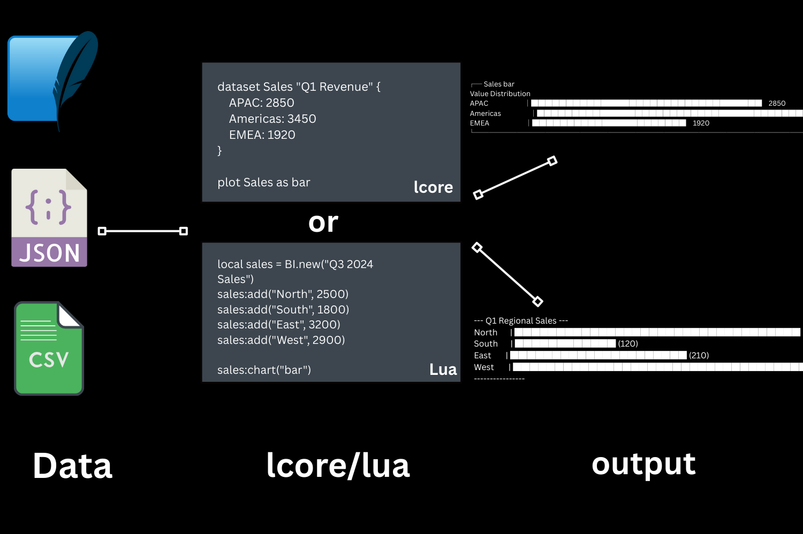

<div id="top" align="center">
    


#### A New Way to Build Data Apps: Orchestrate analytics, logic, and visualization as code.

### [**EXAMPLES**](https://github.com/Sieep-Coding/LunivCore/tree/main/examples) | [**WEBSITE**](https://lunivcore.vercel.app/) | [**LUA**](https://www.lua.org/)
</div>

> [!WARNING]
> We are in alpha. Full release coming Q1/Q2 2026


# LunivCore Framework: Business Intelligence as Code

Build dashboards, analytical reports, and entire BI workflows using `Lua` or the interpreted `lcore` language without the overhead of traditional enterprise tools.

We provide a foundation for individuals, teams, and enterprises seeking to standardize analytics, accelerate experimentation, and integrate BI logic directly into their stack.

This monorepo houses the full `LunivCore` ecosystem: 
- a compact `lcore interpreter` written in **C/Lua**
- structured documentation website
- development utilities like a [Lua unit testing framework](https://github.com/Sieep-Coding/LunivCore/tree/main/src/lua/Check-Your-Lua), designed to deliver a fast, extensible, and highly maintainable BI platform.
- Permissable [MIT LICENSE](LICENSE.md)*
- [Examples](https://github.com/Sieep-Coding/LunivCore/tree/main/examples)


*Dependencies and outside libraries subject to different licensing terms

# How It Works



# See It In Action

LunivCore is an open-source, engineer focused alternative to [PowerBI](https://www.microsoft.com/en-us/power-platform/products/power-bi), [Jupyter Notebook](https://jupyter.org/), [evidence.dev](https://evidence.dev/), [Tableau](https://www.tableau.com/), [Streamlit](https://streamlit.io/), [Shiny](https://shiny.posit.co/), and other business intelligence/reporting tool.

Instantly start answering the most important questions for your business.

This `.lcore` file:

```bash
# Sales Report Q1 (examples/helloworld.lcore)
text "Regional sales are strong this year in the West."

dataset Sales "Q1 Regional Sales" {
    North: 340
    South: 120
    East: 210
    West: 450
}

plot Sales as bar

view MarketShare "Market Share by Segment (%)" {
    SegmentA: 90
    SegmentB: 8
    SegmentC: 2
    text "Analysis Notes: North dominates the market."
    text "Segments B and C are negligible."
}
plot MarketShare as bar

```

#### Outputs:

```text
╔════════════════════════════════════════════════╗
║Regional sales are strong this year in the West.║
╚════════════════════════════════════════════════╝
--- Q1 Regional Sales ---
North      | ██████████████████████████████████ (340)
South      | ████████████ (120)
East       | █████████████████████ (210)
West       | █████████████████████████████████████████████ (450)
----------------
╔════════════════════════════════════════════════╗
║          Market Share by Segment (%)           ║
╠════════════════════════════════════════════════╣
║ SegmentA : 90 │█████████████████████████████ │ ║
║ SegmentB :  8 │███░░░░░░░░░░░░░░░░░░░░░░░░░░ │ ║
║ SegmentC :  2 │█░░░░░░░░░░░░░░░░░░░░░░░░░░░░ │ ║
║  Analysis Notes: North dominates the market.   ║
║        Segments B and C are negligible.        ║
╚════════════════════════════════════════════════╝
```

Or run it on the Lua VM through C functions:

```lua
-- Create datasets dynamically and aggregate values
local regions = {"North", "South", "East", "West"}
local q1_values = {340, 210, 210, 450}
local q2_values = {400, 190, 220, 470}

local q1_ds = BI.new("Q1 Aggregation KPIs")
local q2_ds = BI.new("Q2 Aggregation KPIs")

-- Populate datasets using loops
for i, region in ipairs(regions) do
    q1_ds:add(region, q1_values[i])
    q2_ds:add(region, q2_values[i])
end

-- Perform basic analytics
print("Q1 Total:", q1_ds:sum())
print("Q2 Total:", q2_ds:sum())
print("Difference Q2-Q1:", q2_ds:sum() - q1_ds:sum())

-- Advanced analytics: conditional highlights
for i, region in ipairs(regions) do
    local q1_val = q1_values[i]
    local q2_val = q2_values[i]
    if q2_val > q1_val then
        BI.text(region .. " exceeded projections by " .. (q2_val - q1_val))
    else
        BI.text(region .. " lagged projections by " .. (q1_val - q2_val))
    end
end

-- Combine datasets into a single view
local market_view = {
    title = "Quarterly Market Share Comparison",
    rows = {},
    children = {}
}

for i, region in ipairs(regions) do
    table.insert(market_view.rows, {
        name = region,
        value = q2_values[i]
    })
    table.insert(market_view.children, {
        type = "text",
        value = string.format("%s Q1: %d, Q2: %d", region, q1_values[i], q2_values[i])
    })
end

BI.render_view(market_view)

-- Final summary
BI.text("All datasets processed successfully.")

```

```text
Q1 Total: 1210
Q2 Total: 1280
Difference Q2-Q1: 70
╔════════════════════════════════════════════════╗
║        North exceeded projections by 60        ║
╚════════════════════════════════════════════════╝
╔════════════════════════════════════════════════╗
║         South lagged projections by 20         ║
╚════════════════════════════════════════════════╝
╔════════════════════════════════════════════════╗
║        East exceeded projections by 10         ║
╚════════════════════════════════════════════════╝
╔════════════════════════════════════════════════╗
║        West exceeded projections by 20         ║
╚════════════════════════════════════════════════╝
╔════════════════════════════════════════════════╗
║       Quarterly Market Share Comparison        ║
╠════════════════════════════════════════════════╣
║ North : 400 │██████████████████████████░░░░░ │ ║
║ South : 190 │█████████████░░░░░░░░░░░░░░░░░░ │ ║
║ East  : 220 │███████████████░░░░░░░░░░░░░░░░ │ ║
║ West  : 470 │███████████████████████████████ │ ║
║             North Q1: 340, Q2: 400             ║
║             South Q1: 210, Q2: 190             ║
║             East Q1: 210, Q2: 220              ║
║             West Q1: 450, Q2: 470              ║
╚════════════════════════════════════════════════╝
╔════════════════════════════════════════════════╗
║      All datasets processed successfully.      ║
╚════════════════════════════════════════════════╝
```

LunivCore generates a terminal-dashboard or website from markdown-inspired `.lcore` or `Lua` files:

- **Low-level** framework engineered for integration anywhere that supports C, including microcontrollers, websites, servers, and more.
* **Built-in Interpreter:** View the powerful [lcore](https://github.com/Sieep-Coding/LunivCore/tree/main/src/C/lcore) interpreter.
- **SQL-like statements** inside markdown-inspired files to run queries against your data sources
- **Charts and components** are rendered using these query results
- **Templated pages** generate many pages from a single markdown template
- **Loops** and **If / Else** statements allow control of what is displayed to users
- **Coded for Performance**: LunivCore is made with **C**, enabling high-performance.
- **Production-Grade**: Ships with a [Lua unit testing framework.](https://github.com/Sieep-Coding/LunivCore/tree/main/src/lua/Check-Your-Lua)
- **Portable:** Built using standard C (C99) and the embeddable Lua library.
- **Support:** On-going, lifetime support from the passionate dev team at [Luniv Technology](https://luniv.tech/)

## Benchmark Results

The following table summarizes the performance as the dataset size scaled by a factor of nearly **3,000x** (from 5.5K to 11.9M rows).

| Test | Dataset Count (Rows) | Executed Time (ms) | User Time (ms) | System Time (ms) | Throughput |
| :--- | :--- | :--- | :--- | :--- | :--- |
| **1** | 5,508 | 1.64 | 0.23 | 1.47 | **approx 3.3 million rows per second** |
| **2** | 396,647 | 13.46 | 11.05 | 2.41 | **approx 29.5 million rows per second** |
| **3** | 3,173,183 | 88.27 | 78.76 | 9.14 | **approx 35.9 million rows per second** |
| **4** | 6,346,367 | 169.73 | 138.69 | 30.48 | **approx 37.4 million rows per second** |
| **5** | **11,908,037** | **367.70** | **304.11** | **60.99** | **approx 32.4 million rows per second\*** |

[Read the full report.](https://lunivcore.vercel.app/performance/benchmark)


## Why Now?
> I built [LunivCore](https://lunivcore.vercel.app/) after getting tired of the constraints of traditional enterprise BI platforms. 
> 
> Instead of relying on a Markdown-driven system like [evidence](https://github.com/evidence-dev/evidence/), I wanted a lower-level foundation with less external dependencies. 
>
>Something lean, predictable, and fully under my control. Using C and Lua gives me that flexibility.
>
> This gives me the freedom to layer features on top such as Markdown rendering, web output, and anything else in a deliberate manner.
>
>  -Nick

# License

LunivCore is licensed under the MIT license. See the [LICENSE](LICENSE.md) file for licensing information.
